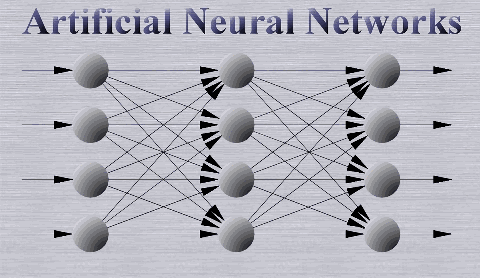
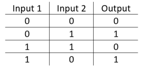
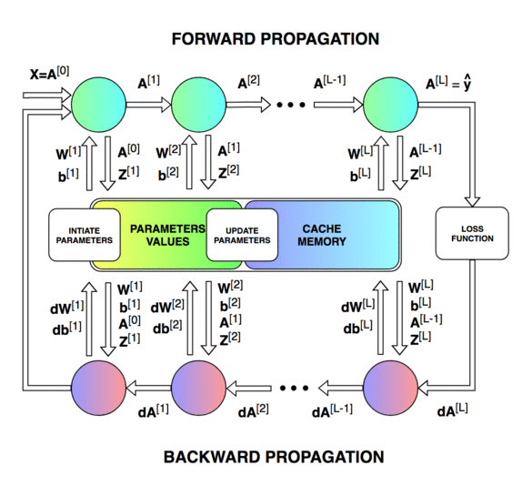
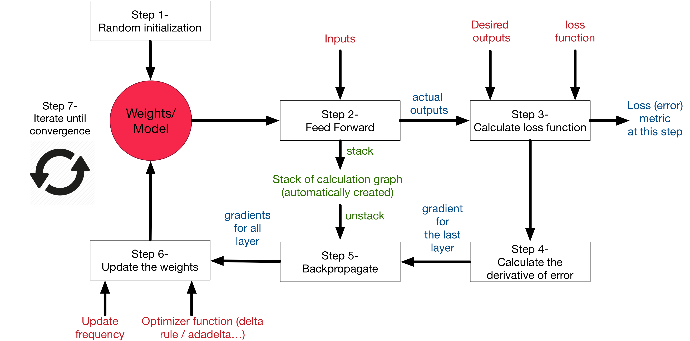

# Artificial Neural Network in C
## Fitting XOR function 

A supervised neural network can be presented as a black box learn and predict as following:

Being supervised problem, it requires labelled data.

## Our goal is to fit XOR function

This is done in 2 steps:

1. Forward propagation

2. Backward propagation

Initially, the error in the networks were high
<li>Step 50, Error: 0.7563</li>
 
After, 1000 iterations:
<li>Step 1000, Error: 0.0432</li>
 
Hence, the network was improving during each iteration by adjusting the weights calculated using loss function.

##

Overall process can be summarized as:

